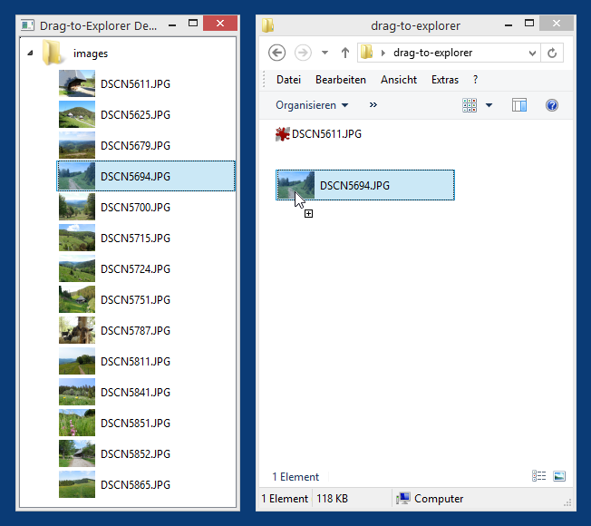

# PyQt5CopyHookHandler

A generic copy hook shell extension that can be used to implement dragging items as files/folders to Windows Explorer in PyQt/PySide applications

**Description**

This is a simple [Copy Hook Handler](https://docs.microsoft.com/en-us/windows/win32/shell/how-to-create-copy-hook-handlers) Shell Extension that watches Explorer for copy actions that involve a (dummy) folder called "\_\_qt5drop\_\_". If it detects such a copy action, it sends the target path of the copy action as WM_COPYDATA message to all top-level windows of a specific window class (by default "Qt5152QWindowIcon" for applications based on Qt 5.15.2).

This can be used to drag & drop arbitrary items from PyQt/PySide (or also other) applications to Explorer, and then actually save files or folders in the corresponding target folder. Possible use cases might be FTP/WebDAV GUI applications, disk image explorers etc.

The window class used as target of the WM_COPYDATA messages is loaded from a string resource, and therefor can be changed by editing and compiling the resources of [PyQt5CopyHookHandler.dll](release/x64/PyQt5CopyHookHandler.dll), using e.g. [Resource Hacker](http://www.angusj.com/resourcehacker/), without recompiling the C++ code.

Like any shell extension PyQt5CopyHookHandler.dll must be registered in the system using regsvr32.exe. In addition, Explorer must be restarted before the copy hook handler becomes operative. The release folders contain 3 helper batch scripts for registering and unregistering the shell extension and for quickly restarting Explorer (by killing the current Explorer process and then starting a new one).

Folder [python-demo](python-demo) contains a simple Python demo based on PyQt5 that demonstrates how to implement dragging to Explorer on the Python side. You can either drag individual image items or the complete folder item "images" to some Explorer window, which will then receive the corresponding JPG files or JPG folder.

**Screenshots**

* Python demo in Windows 8.1:

  
